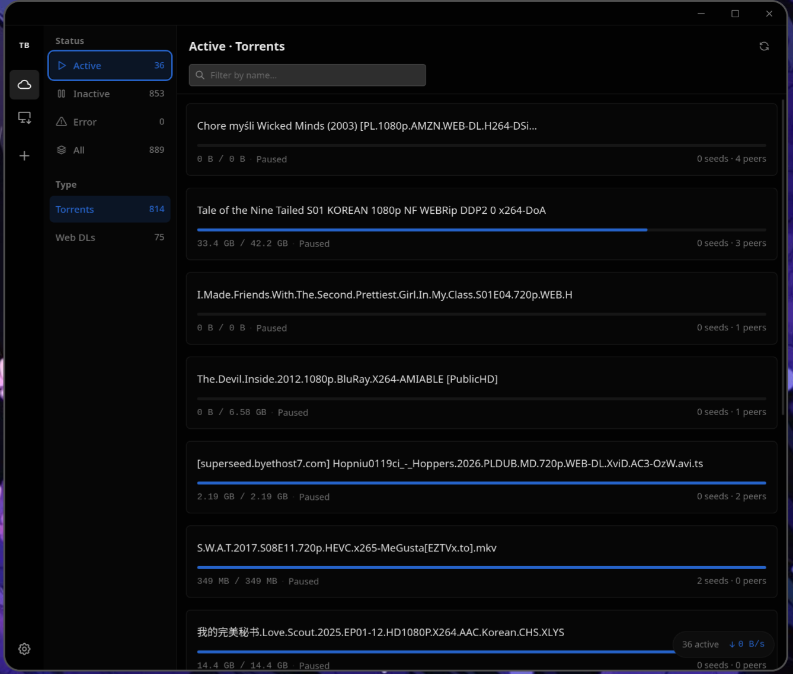
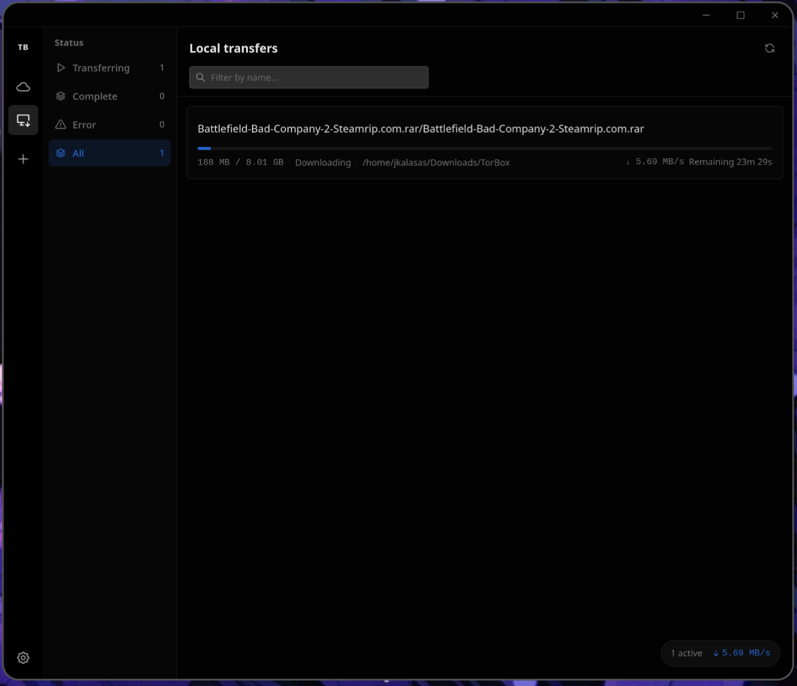

# TorBox

A native desktop client for [TorBox](https://torbox.app). Manage cloud torrents, web downloads, and local transfers without opening a browser.

## Features

- **Cloud torrents & web downloads** — add magnets and URLs, track progress, seeds, and peers
- **Local transfers** — pull finished files from TorBox straight to your machine
- **Browse files** — open a download, pick what you need, grab links or save locally
- **Filters & search** — jump between active, inactive, and errored items, or filter by name
- **Pause, resume, retry** — control cloud downloads and local transfers from one place
- **Download controls** — set a download folder, concurrent limit, and bandwidth cap
- **Dark-forward UI** — clean, compact layout with dark, light, or system theme

## Getting started

1. Create a [TorBox](https://torbox.app) account and copy your API key
2. Open the app and paste the key in Settings
3. Add a magnet link or web URL to start downloading

## License

[MIT](LICENSE)
